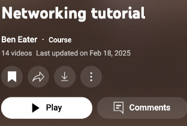
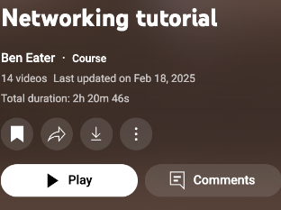

# YouTube Playlist Duration Calculator

Displays total duration of YouTube playlists and courses.

## ✅ What it does

**Course Pages** - Shows total duration below video count  
**Watch Panels** - Shows 🕒 total time next to playlist counter

| Before | After |
|--------|--------|
|  |  |
|  |  |

## 🚀 Installation

1. Download this repo
2. Go to `chrome://extensions/`
3. Enable "Developer mode" 
4. Click "Load unpacked" → select folder

## 🧪 Test it

- [Networking Tutorial - Ben Eater](https://www.youtube.com/playlist?list=PLowKtXNTBypH19whXTVoG3oKSuOcw_XeW)

## ⚠️ Limitations

- **Course playlists**: ✅ Works great
- **Watch page panels**: ✅ Works great  
- **Regular playlists**: ⚠️ Limited (YouTube's dynamic HTML is tricky)

**Languages**: English, Korean

---
MIT License
