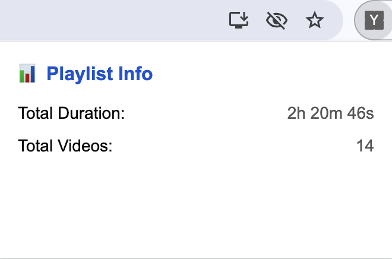
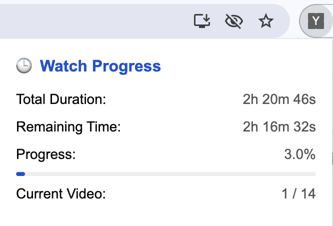

# YouTube Playlist Duration Calculator

Calculate and display total duration of YouTube playlists with detailed progress tracking.

🔗 **[Install from Chrome Web Store](https://chromewebstore.google.com/detail/hpmdghmpbgldhdfopeegihkbmdgcgcbg?utm_source=item-share-cb)**

---

## ✅ What it does

**Course Pages** – Shows total duration below video count  
**Watch Panels** – Shows 🕒 total time next to playlist counter  
**Extension Popup** – Click extension icon for detailed playlist info

| Before | After |
|--------|--------|
|  |  |
|  |  |

---

## 📊 Extension Popup

| **YouTube Playlist** | **YouTube Watch** |
|----------------------|-------------------|
|  |  |

---

## 🚀 Installation (Manual)

1. Download this repo
2. Go to `chrome://extensions/`
3. Enable "Developer mode"
4. Click "Load unpacked" → select folder
5. **Click the extension icon** to view playlist info

---

## 🧪 Test it

- [Networking Tutorial – Ben Eater](https://www.youtube.com/playlist?list=PLowKtXNTBypH19whXTVoG3oKSuOcw_XeW)

---

## 🎯 How to use

- **Page Integration**: Duration shows automatically in YouTube UI
- **Extension Popup**: Click extension icon for detailed info

---

## ⚠️ Compatibility

- **Course playlists**: ✅ Full support  
- **Watch page panels**: ✅ Full support  
- **Regular playlists**: ⚠️ UI integration limited (popup works)

**Languages**: English, Korean

---

MIT License
